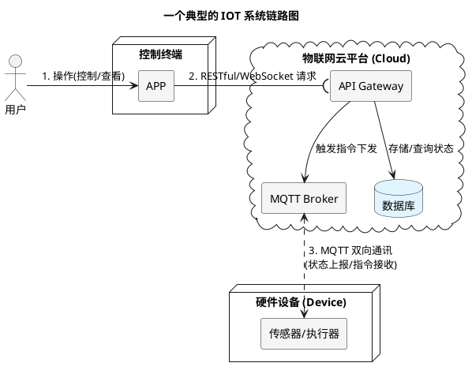
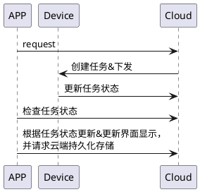
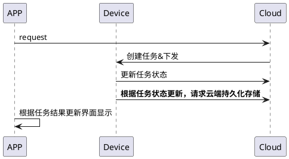

> IOT数据更新思考

---

# 背景&需求

假定现有通信三方，云端、APP端、设备端(Linux)，的一套IOT(物联网)系统。

---

某个业务升级功能，由于APP发起，流程如下:

1. APP 请求云端，云端创建唯一job-id(任务标识)，回给APP，并下发任务给设备端执行；
  
(job-id 在云端维护， 监控&维护任务状态。)

2. 设备端解析云端下发的任务，进行下载&安装，之后更新job-id状态；

3. APP 轮询云端接口，通过JOB-ID 来查询最终的结果，如果完成，则触发云端的更新接口，同步最终升级的版本；

---

# 问题场景

APP 触发任务后被杀死，设备端正常被触发，APP再次进入，没有上下文等信息，无法同步状态，最终导致设备端和APP读取的状态不一致。

所以，需要设备端更新最终的状态。

---

---

# 进一步延伸，讨论问题核心

在多方的IOT通信架构中，需要由谁来触发云端的更新数据动作？

---

通信三方APP、端、云的不同职责，典型的IOT架构职责如下所示:

> APP

- 承载用于意图；
- 最不可靠；
- 发起请求，展示结果；

> 设备端

- 执行任务；
- 采集数据；
- 上报结果；

> 云

- 全局视角，知道其他两方状态；
- 调度任务；
- 存储数据，维护状态；

分不同数据种类。

TODO: 
凡是"设备执行的结果"，就让设备侧上报；app 只负责"触发意图"和"展示结果"，不参与收尾写入。

即，依赖执行过程的结果，由执行者写入。

---

> 如何设计架构？

区分角色，思考结果。

---

> 进一步扩展

根据这个问题，进一步扩展，AI时代更需要设计系统的"架构师"。

AI 擅长解决通用技术问题，而结合实际场景、在需求上，进一步划定边界，需要由开发者结合实际业务场景，进行全局审视规划。

异常场景需要架构师去设计，以提升系统的鲁棒性。

这类异常不是 bug，是系统边界没划清楚。

AI辅助开发，需要工程师根据业务需求，翻译成一套技术上自洽、职责明确的系统方案。

---

> 对我意义

这个问题让我发现，作为软件工程师，我会尽可能地在开发层面，避免和解决纯技术异常，而在实际用户场景中的业务/物理场景异常，即用户层面异常，在开发过程中还需进一步结合，将视角拉远。审视全局的协调性。

技术上的"能实现"和架构上的"该谁做"是两回事。

这是我对这个简单问题背后的一些思考。

---

TODO: Device Shadow