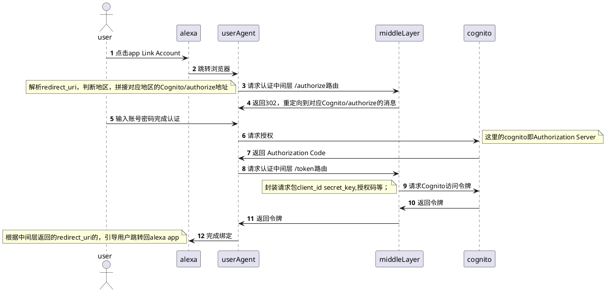

> Alexa多地区部署中，有关Cognito认证的问题。
> 问题的关键在于，我对后端不熟悉，实现此功能，只要依赖的就是OAuth2.0协议。

# 参考

- https://cloud.tencent.com/developer/article/2418791
- https://zhuanlan.zhihu.com/p/687035066

Alexa

- https://developer.amazon.com/en-US/docs/alexa/account-linking/requirements-account-linking.html#authorization-uri-requirements
- https://developer.amazon.com/en-US/docs/alexa/account-linking/account-linking-concepts.html#authorization-code-grant
- https://developer.amazon.com/en-US/docs/alexa/account-linking/add-account-linking.html
- https://medium.com/@mukul_jain/alexa-user-account-linking-using-aws-cognito-f19ab882cabc

补充

- https://www.ruanyifeng.com/blog/2014/05/oauth_2_0.html

---

# OAuth2.0

## 是什么？

> 一套关于授权的行业标准协议。
OAuth 2.0 允许用户授权第三方应用访问他们在另一个服务提供方上的数据，而无需分享他们的凭据（如用户名、密码）。

---

## 授权码模式（Authorization Code）

### 流程概述

1. 用户访问客户端应用：用户在浏览器中访问客户端应用程序（如一个Web应用）。
2. 客户端引导用户到授权服务器：客户端应用将用户重定向到授权服务器的登录页面，通常会携带一些参数（如客户端ID、重定向URI、响应类型等）。
3. 用户在授权服务器登录并授权：用户在授权服务器上输入凭据（如用户名和密码）进行登录，并授权客户端应用访问其资源。
4. 授权服务器返回授权码：授权服务器验证用户身份和授权请求后，将用户重定向回客户端应用的指定重定向URI，并附带一个授权码。
5. 客户端后端使用授权码获取访问令牌：客户端应用的后端服务器收到授权码后，会向授权服务器发送一个请求，使用授权码换取访问令牌和刷新令牌。
6. 客户端后端使用访问令牌访问资源服务器：客户端后端服务器使用获取到的访问令牌向资源服务器请求用户授权的资源。
在OAuth 2.0的授权码流程中，用户被引导到资源服务器进行身份验证和授权。然后，用户会被重定向回客户端应用程序，并带有一个授权码。最后，客户端应用程序将使用这个授权码通过后端服务器与授权服务器交互，以获取访问令牌。这个过程发生在后端，用户无法看到或接触到，增加了安全性。

可以结合下面中间层流程图理解。

---

### 优点

高安全性、广泛的适用性以及对安全最佳实践的遵循，成为了OAuth 2.0中最主流的授权模式。

---

## 其他模式

1. 简化模式（Implicit）
2. 密码模式（Resource Owner Password Credentials）
3. 客户端凭证模式（Client Credentials）

非主流模式，这里不做赘述。

---

# Alexa 应用链接 Cognito 账户

> 前提

Cognito已创建好对应的非公开Cognito应用程序客户端。

Alexa 和 Cognito都支持标准的OAuth2.0授权码认证方式。

---

## 简单方式

对于认证页面，AWS Cognito中也可以快速构建出一个应用登录界面，可以不用麻烦的自定义Web网页，同时认证和token的路由，也提供了现成的，分别是 /oauth2/authorize , /oauth2/token。

如无特殊需要，直接在Alexa 后台的 “Account Linking” 页面直接指定两个地址即可，同时，填入对应的客户端ID和客户端密钥。

在通过Alexa app应用页面绑定Lymow账号时，就会自动跳转到Lymow登录页面，在登录成功后完成授权，然后返回Alexa app，成功绑定。

其中一些具体的OAuth2交互细节，Alexa已经帮我们完成了，不用过于关心。

---

## 添加认证中间层方式

### 为什么要这样?

在 AWS Cloud 中，对于用户单一地区的应用，或是用户信息都存储在同一区域应用，那么使用上述 “简单认证” 中所示内容即可。
对于多Region应用，不同区域的用户数据存储在不同的AWS区域中，相应的，Cognito服务也存在于多个区域中。

但是，由于Alexa设计问题，不同区域的Alexa技能，不能为其单独设置 Account Linking 信息，即，无法根据用户区域，绑定对应区域的账号。

所以，需要我们在绑定账号过程中，添加一个“认证中间层”，将原来托管给Alexa的认证动作，手动根据当前账号的区域，转发给对应地区的Cognito服务，最后将结果，转发回Alexa，完成认证。

---

### 流程解析

