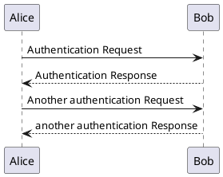

> 准备记录一些平时用的不多的MD语法，刚才想了一下，可以简单整理一下，后面可以出一个入门的教程，相对于其他内容，这个东西我还是有一些经验的。

> 相关内容网上参考很多，我在这里只简单做一个指引。

> 可以新建哔哩哔哩【开发工具】or 【工具】视频专栏。

本文对应视频 —— []()

# 前言

> 本文适用人群

刚学计算机的小白，或者是在寻找一种记笔记、写博客的方式。

如果你经常需要写笔记、写博客，或者是想更高效地写技术文档，那 Markdown 一定是你必须掌握的工具。

> 是什么？

Markdown 是一种轻量级标记语言（Lightweight Markup Language）。

简单说，它是一种用纯文本编写的格式化文档。

> 为什么使用MD？

- 多平台支持，写博客、文档方便；
- 可支持的插件丰富，例如Latex、PlantUML等；
- 可兼容性强，有很多相关的文本编辑器支持,例如: Typora、VSCode、语雀等，并且支持导出PDF、Word等格式；

对于程序员来说，一些代码提交平台，Github、GitLab等，仓库README.md更是必备，加之纯文本，版本管理清晰。

> 如何学习 ?

- 熟悉简单语法，然后在使用中逐渐熟悉；

对于计算机专业的同学来说，我也希望你在一开始学习语言的时候，就学习并使用MarkDown。

同时，使用Markdown开始记笔记，发到自己的博客上面，做一个简单的积累。

> 如果你不想折腾，可以用一些支持MarkDown的博客网站，例如:

- 博客园
- CSDN
- 知乎
- 掘金
- 51TOC 等

> 当然，你也可以搭建自己的博客网站:

- Wordpress
- Halo
- Hexo
- Docsify 等

搜索相关关键字，官网基本都有部署教程，或者看一下其他博主的文章&视频。

---

# 相关工具

> 在开始学习之前，首先要安装相关的软件，例如: Typora、VsCode等。

文本演示内容，使用VSCode进行相关MD语法演示。

---

## VSCode

> 安装相关插件，左侧源码，右侧渲染预览，可以直观的看到效果。

不只是用于MD写作，VSCode可以配置很多语言的开发环境。

> MarkDown插件示例: 

- Markdown All in One (基本语法)
- Markdown Preview Enhanced (增强预览与渲染)


---

## Typora

> 支持源代码模式以及直接在渲染之后编辑，相对于VSCode，我觉得是更加方便，更像是一个完整的文本编辑器。

让我觉得最方便的，就是可以联动PicGo，直接将粘贴的图片通过PigGo上传到图床中。如何所示: 


---

## PicGo

> 一个用于快速上传图片并获取图片 URL 链接的工具。 —— 来自[官方文档](https://picgo.github.io/PicGo-Doc/zh/guide/)

这样，当你在写 Markdown 文章时，只要复制这个链接，就能直接插入图片。

而且相对于本地文章，你可以更方便的迁移到多个平台。

图片链接都能直接通用，不用再担心路径出错或者图片丢失。
> 配置图床相关设置即可开始使用，例如: 


---

# 基本语法

> 详见相关文档 —— https://markdown.com.cn/basic-syntax/

这里只做简单演示，演示下常用的语法，然后结合官方文档，作为补充。

> 空格问题

MarkDown中，首行缩进的格会被吞掉，文字中的连续空格会被折叠为一个空格，

首行缩进，可以这个实现:

```bash
emsp;&emsp; 
```

---

# 进阶用法

## HTML 语法增强

> 可以使用HTML来完成一些MD不支持的功能，例如:

- 文字居中、设置颜色

<p align="center" style="color:#3498db;">这是一段居中显示的蓝色文字。</p>

```html
<p align="center" style="color:#3498db;">这是一段居中显示的蓝色文字。</p>

```


---

## PantUML 

有时候我们在文档里需要画流程图、时序图、类图，
Markdown 自身不支持这些，但可以通过 PlantUML 来实现。

> [PlantUML中文文档](https://plantuml.com/zh/)

> 示例:



---

## LaTeX

> 数学公式支持 —— [LaTex官方网站](https://www.latex-project.org/)


LaTeX 是一个独立的排版系统，完全不依赖 Markdown 或 HTML。
它自己就能从 .tex 文件生成高质量的 PDF、书籍、论文、幻灯片等。

在MarkDown中，同样可以嵌入 LaTeX 数学语法，例如:

- 行内公式

例如: $O(\log n)$

```latex
# 注意 log 和 n 之间的空格
$O(\log n)$
```

- 独立公式 

独立公式更适合复杂公式或强调公式。

例如:
 $$
    O(logn)
 $$

```latex
$$
    O(logn)
$$
```


---

# 补充分享

可以基于Github Page + [Docsify](https://docsify.js.org/#/zh-cn/) 搭一个静态博客，然后结合Github的在线VSCode编辑器，用于个人在线笔记或是博客网站，例如: —— [半生瓜のdoc](doc.banshengua.top)


同样支持LaTex、PlantUML渲染。

直接可以在平板上更新一些内容。


---

# 结尾

其实一直以来我都想做一些类似于这样的分享或者教程，不够由于技术不精加之自己太拖延了，会列很多TODO，不过很少有DONE的，导致想法迟迟没有落地，从这个视频开始，我的想法会陆陆续续落地成内容。

当然你也可以关注我的博客 —— [半生瓜のblog](banshengua.top)，或是笔记分站 —— [半生瓜のdoc](doc.banshengua.top)

感谢你的收看，我们下期再见。