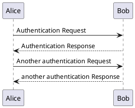

> 使用drow io等UI拖动即可画图的工具固然方便上手，但是我觉得为了长久可维护，还是要使用代码来维护。

> test

```plantuml
@startuml
Alice -> Bob: Authentication Request
Bob --> Alice: Authentication Response

Alice -> Bob: Another authentication Request
Alice <-- Bob: another authentication Response
@enduml
```