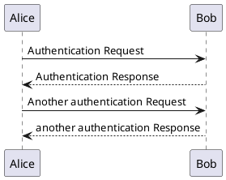
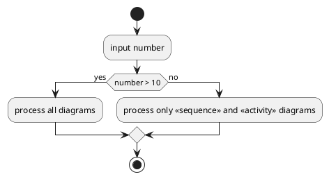

> 使用drow io等UI拖动即可画图的工具固然方便上手，但是我觉得为了长久可维护，还是要使用代码来维护。

> [PlantUML在线预览](www.plantuml.com/plantuml)

> [PlantUML中文文档](https://plantuml.com/zh/)

> PlantUML 为创建序列图提供了一种强大而高效的方法。它强调简洁和精确，对于任何希望轻松制作清晰准确图表的人来说，都是一笔宝贵的财富。 —— From PLantUML官方文档

> [Ubuntu PlantUML VsCode配置]

- https://blog.csdn.net/yinhezhanshen/article/details/147940372
- https://blog.csdn.net/weixin_41111116/article/details/129582436

`快速配置`

```bash
sudo apt-get install openjdk-8-jdk
sudo apt-get install graphviz

# VSCode 安装插件 PlantUML
``` 

> 补充: MarkDown增强渲染PlantUML 

- "Ctrl + ," 打开设置 搜索 markdown-preview-enhanced.plantumlJarPath， 配置路径

- 例如:

```bash
# download rom github.com/plantuml/plantuml/releases/

/home/xuan/workspace/package/plantuml/plantuml-1.2025.8.jar
```

> tips

- 避免大小写切换，可以只用英文小写；
- 自动标记每一步的序号 autonumber；
- 注释，在交互行下 note left(riht): some info；
- 消息注释/换行，消息中添加 \n ；
- 
> test 时序图

文件扩展名 .puml



---

> test 活动图



---

> TODO: 整理出第二篇文章，同样为 《入门指北》系列，要不要想个新名字？这太普遍了......

不过这篇文章在短时间内不会出来，我需要多画一些，从而用熟练，用法不用全讲，一个活动图，一个时序图？+ 类图即可。

---

# 补充说明

> vscode 复制图片的清晰度

可以多次放大后，然后再点击复制，这样粘贴出来的图片会清晰很多。