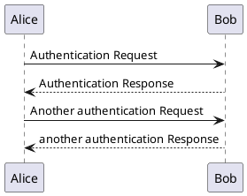

> 使用drow io等UI拖动即可画图的工具固然方便上手，但是我觉得为了长久可维护，还是要使用代码来维护。

> [PlantUML在线预览](www.plantuml.com/plantuml)

> [PlantUML中文文档](https://plantuml.com/zh/)

> [Ubuntu PlantUML VsCode配置]

- https://blog.csdn.net/yinhezhanshen/article/details/147940372
- https://blog.csdn.net/weixin_41111116/article/details/129582436

`快速配置`

```bash
sudo apt-get install openjdk-8-jdk
sudo apt-get install graphviz

# VSCode 安装插件 PlantUML
``` 

> 补充: MarkDown增强渲染PlantUML 

- "Ctrl + ," 打开设置 搜索 markdown-preview-enhanced.plantumlJarPath， 配置路径

- 例如:

```bash
/home/xuan/workspace/package/plantuml/plantuml-1.2025.8.jar
```

> test

