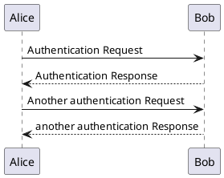
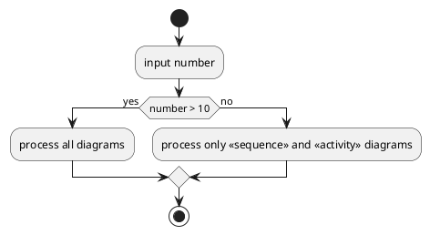

> 使用drow io等UI拖动即可画图的工具固然方便上手，但是我觉得为了长久可维护，还是要使用代码来维护。

> [PlantUML在线预览](www.plantuml.com/plantuml)

> [PlantUML中文文档](https://plantuml.com/zh/)

> PlantUML 为创建序列图提供了一种强大而高效的方法。它强调简洁和精确，对于任何希望轻松制作清晰准确图表的人来说，都是一笔宝贵的财富。 —— From PLantUML官方文档

> [Ubuntu PlantUML VsCode配置]

- https://blog.csdn.net/yinhezhanshen/article/details/147940372
- https://blog.csdn.net/weixin_41111116/article/details/129582436

`快速配置`

```bash
sudo apt-get install openjdk-8-jdk
sudo apt-get install graphviz

# VSCode 安装插件 PlantUML
``` 

> 补充: MarkDown增强渲染PlantUML 

- "Ctrl + ," 打开设置 搜索 markdown-preview-enhanced.plantumlJarPath， 配置路径

- 例如:

```bash
# download from https://plantuml.com/zh/download

/home/xuan/workspace/package/plantuml/plantuml-1.2025.8.jar
```

---

> windows？

- 安装 https://www.graphviz.org/download/ ，并添加到环境变量
- 

---

# 环境配置总结


- Java JDK 
  - PlantUML依赖Java运行时环境来解析和生成UML图；
    - 必须配置环境变量JAVA_HOME，PlantUML 插件必须读取 JAVA_HOME 来定位 Java 安装目录；
    - 参考: [](https://www.cnblogs.com/JerryCans/articles/18828364)
- Graphviz
  - 渲染图像
    - 下载: https://graphviz.org/download/
- PlantUML JAR
  - 单独使用Plantuml
    - 下载: https://plantuml.com/zh/download
- vscode 安装 Plantuml插件，用来 alt + d 快速渲染

---

> tips

- 避免大小写切换，可以只用英文小写；
- 自动标记每一步的序号 autonumber；
- 注释，在交互行下 note left(riht): some info；
- 消息注释/换行，消息中添加 \n ；
- 
> test 时序图

文件扩展名 .puml



---

> test 活动图



---

# Demo

简单示范一些个人觉得常用的图。

## 序列图


## 活动图


## 组件图

可以当架构图那么画，表达系统上下文交互图，和简单的数据流走向，不要详细的交互细节。

隐藏类细节，强调连线含义。对于一张用来表达架构（尤其是系统级架构）的图来说，“简单”往往意味着更好，


## 类图

表达代码结构 + 静态关系。


---


---

> TODO: 整理出第二篇文章，同样为 《入门指北》系列，要不要想个新名字？这太普遍了......

不过这篇文章在短时间内不会出来，我需要多画一些，从而用熟练，用法不用全讲，一个活动图，一个时序图？+ 类图即可。

---

# 补充说明

> vscode 复制图片的清晰度

可以多次放大后，然后再点击复制，这样粘贴出来的图片会清晰很多。

---