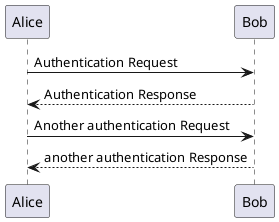

> 使用drow io等UI拖动即可画图的工具固然方便上手，但是我觉得为了长久可维护，还是要使用代码来维护。

> [PlantUML在线预览](www.plantuml.com/plantuml)

> [Ubuntu PlantUML VsCode配置](https://blog.csdn.net/yinhezhanshen/article/details/147940372)

- 补充: "Ctrl + ," 打开设置 搜索 markdown-preview-enhanced.plantumlJarPath， 配置路径

> test

